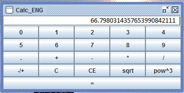

# Калькулятор  Calc_ENG

## В данной статье мы рассмотрим процесс создания простой программы,

### которая состоит из 21 кнопки , и дисплея калькулятора .

✦ 0) При нажатии цифры текущая цифра добавляется на дисплей .

✦ 1) При нажатии кнопки "С" удаляется последняя цифра .

✦ 2) При нажатии кнопки "СE" дисплей очищается .

✦ 3) При нажатии на операцию введённое число сбрасывается .

✦ 4) При нажатии на кнопку "-/+" значение меняется на положительное или отрицательное .

✦ 5) При нажатии на кнопку "sqrt" выполняется соответствующая скрипту функция ,выведения из текущего числа квадратного корня .
             
✦ 6) При нажатии на кнопку "pow^3" выполняется возведение текущего числа в соответствующую степень .			 

✦ 7) При нажатии на кнопку  "=" выполняется действие и результат выводится на дисплей .

✦ 8) При желании , можно зафоловить мой аккаунт в https://twitter.com/rodomod .

✦ 9) Десятичная точка "."   как Вы знаете разделяет целую и дробные части числа .

